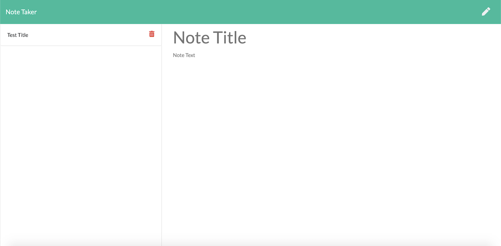

# Note Taker

Link to deployed app: [Note-Taker](https://murmuring-shore-68686.herokuapp.com)

## Description
Create an application that can be used to write, save, and delete notes. This application will use an express backend and save and retrieve note data from a JSON file. It will also be using different modules and different API routes generated through the backend.

## How it works

### Home Page 

### Notes Page 

### After adding notes

### Viewing specific notes

## Credits/Technologies
    1. Node.js
    2. Express.js
    3. JavaScript
    4. HTML
    5. CSS